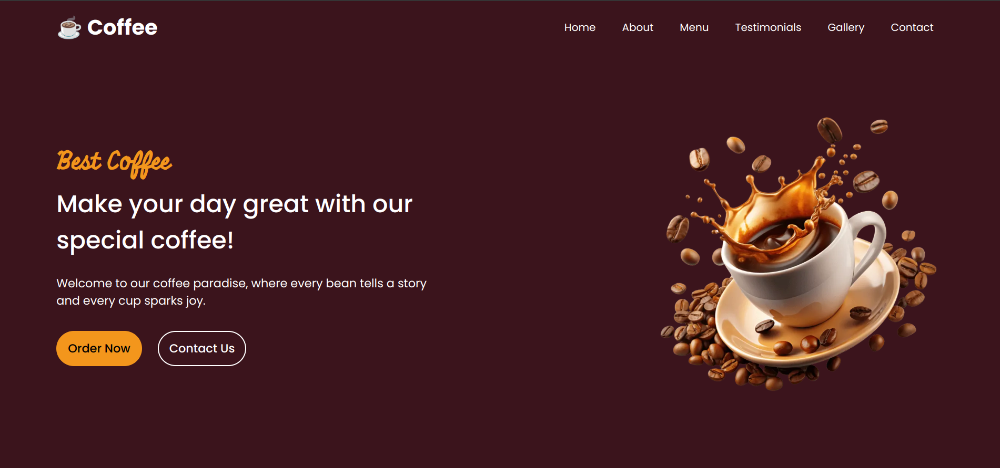

# Hi There 👋, Nedjima is back

## Table of Content:

- [Overview](#overview)
  - [The Project](#the-project)
  - [Screenshot](#screenshot)
  - [Links](#links)
- [My process](#my-process)
  - [Built with](#built-with)
  - [What I learned](#what-I-learned)
  - [Continued development](#continued-development)
- [Author](#author)
- [Acknowledgments](#acknowledgments)

## Overview

### The project

Converting a figma template into a live website with user interactivity. The page is fully responsive and respects SEO and web performance standards

### Screenshot

### Links

- Live Site URL: [Site]()

## My process

### Built with

- HTML5
- SCSS
- Vanilla JavaScript

### What I learned

- I learned structure projects and how to use it to make my css more powerful
- I also learned how to use an external js library and include it into my project.
- In addition to improving my skills in reponsive design

### Continued development

- This is my first project using SCSS properly and I find it so powerfull. I am so exited to use it in future projects.

## Author

- Frontend Mentor - [@Mohammed-Nedjima](https://www.frontendmentor.io/profile/Mohammed-Nedjima)
- Linkedin - [@Nedjima_Mohammed_Ayoub](https://www.linkedin.com/in/mohammed-ayoub-nedjima/)

## Acknowledgments

Thanks to [coding Nepale](https://www.codingnepalweb.com/) for providing such amazing design.It saved me a lot of time in building a design and searching for appropiate image.It also helped in improving my skills in JavaScript and gave me a push to the next level.
